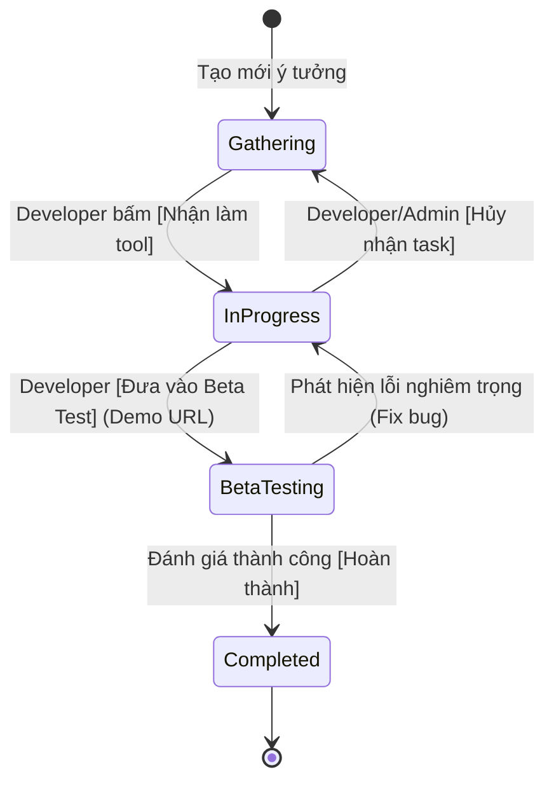

# BÁO CÁO ĐẶC TẢ YÊU CẦU & KIẾN TRÚC HỆ THỐNG TOOLHUNT ENTERPRISE (R1 - R5)

**Người thực hiện**: Survey Explorer 2 (Requirements & Specification Architect)  
**Mã dự án**: ToolHunt Enterprise v3.0.0  
**Thư mục làm việc**: `d:/Profile/AutoFillSheet/.agents/survey_explorer_2`  
**Ngày hoàn thành**: 2026-08-28  

---

## 1. OBSERVATION (Quan Sát Hiện Trạng & Yêu Cầu)

### 1.1. Hiện trạng Codebase Baseline (v2.0.0)
Qua khảo sát chi tiết toàn bộ mã nguồn tại `d:/Profile/AutoFillSheet`:
- **Google Apps Script Backend** (`google-apps-script/Code.js`):
  - Đã có khung xử lý Webhook Telegram (`doPost`) và REST API (`doGet`).
  - Hỗ trợ các lệnh cơ bản: `/idea`, `/top`, `/myideas`, `/stats`, `/status`.
  - Xử lý bình chọn `vote_<id>` với cơ chế Toggle Unvote và chống spam cơ bản.
  - Chưa có cơ chế gọi AI kiểm tra trùng lặp (R1), chưa có luồng Claim task / Milestones (R2), chưa có cơ chế trích xuất voter để gửi Direct Message thông báo Beta (R3), chưa có bảng và logic quản lý Quỹ thưởng Bounty (R4), chưa hỗ trợ phân quyền 4 cấp RBAC (R5).
- **Google Sheets Setup Helper** (`google-apps-script/SetupHelper.js`):
  - Khởi tạo 4 sheet: `Ideas` (12 cột cơ bản), `Votes` (5 cột), `Config` (3 cột), `Admins` (4 cột).
  - Thiếu các trường dữ liệu Enterprise: Developer phụ trách, Ngày nhận task, Tiến độ (Milestones), Demo/Repo Link, Tổng Bounty, Bảng `Bounties`, Bảng phân quyền `RBAC` (Member, Developer, Manager, Admin), và các cấu hình AI Keys.
- **Web Dashboard & Mini App** (`web-dashboard/index.html`, `app.js`, `styles.css`):
  - Giao diện Tailwind CSS & FontAwesome hỗ trợ xem danh sách, lọc theo trạng thái (`all`, `top`, `voting`, `inprogress`, `completed`), tìm kiếm, đăng ý tưởng và Upvote.
  - Thiếu hiển thị Developer phụ trách, thiếu huy hiệu Bounty, thiếu nút Claim Task và thanh tiến độ Milestones, thiếu modal cảnh báo trùng lặp AI khi tạo ý tưởng.
- **Bộ Kiểm Thử Tự Động** (`scripts/test_simulator.js`):
  - Hiện có 7 ca kiểm thử cơ bản cho cú pháp `/idea`, tạo ý tưởng, upvote, toggle unvote, /top, /stats, và quyền Admin với lệnh `/status`.
  - Cần mở rộng bộ kiểm thử mock toàn diện cho R1 (AI Deduplication), R2 (Claim/Milestones/Unclaim), R3 (Targeted Voter Notifications), R4 (Bounty Crowdfunding), R5 (Enterprise REST API & RBAC).
- **Tài liệu hướng dẫn** (`README.md`, `docs/`):
  - Đã có hướng dẫn cơ bản nhưng cần nâng cấp tài liệu kiến trúc Enterprise, hướng dẫn cấu hình AI Key (Gemini/DeepSeek), quy trình phát triển dành cho Developer và cơ chế Bounty.

---

## 2. LOGIC CHAIN (Chuỗi Suy Luận & Đặc Tả Kỹ Thuật Chi Tiết R1 - R5)

---

### R1. ĐẶC TẢ AI DUPLICATE DETECTION (KIỂM TRA NGỮ NGHĨA BẰNG DEEPSEEK & GEMINI)

#### A. Mục tiêu & Nguyên lý hoạt động
Khi người dùng gửi ý tưởng mới (qua Telegram `/idea` hoặc Web Dashboard / Mini App), hệ thống không chỉ so khớp từ khóa đơn thuần mà sử dụng Mô hình Ngôn ngữ Lớn (LLM) để hiểu **bản chất bài toán và giải pháp** được đề xuất, sau đó so sánh với danh sách các ý tưởng đang tồn tại trong cơ sở dữ liệu Google Sheets.

#### B. Nhà cung cấp AI & Cơ chế dự phòng (Dual-Engine AI)
1. **Google Gemini API (Mặc định - Free Tier)**:
   - Endpoint: `https://generativelanguage.googleapis.com/v1beta/models/{MODEL_NAME}:generateContent?key={GEMINI_API_KEY}`
   - Model đề xuất: `gemini-1.5-flash` hoặc `gemini-2.0-flash` (tốc độ phản hồi cực nhanh ~500ms, độ chính xác cao, miễn phí quota lớn).
2. **DeepSeek API (Chuyên sâu về Code & Logic)**:
   - Endpoint: `https://api.deepseek.com/chat/completions`
   - Model đề xuất: `deepseek-chat` / `deepseek-v3`
   - Headers: `Authorization: Bearer {DEEPSEEK_API_KEY}`, `Content-Type: application/json`.
3. **Cấu hình động trong Sheet `Config`**:
   - `AI_PROVIDER`: `GEMINI` hoặc `DEEPSEEK` (chuyển đổi linh hoạt mà không cần sửa code).
   - `GEMINI_API_KEY`: Khóa API của Google AI Studio.
   - `DEEPSEEK_API_KEY`: Khóa API DeepSeek.
   - `SIMILARITY_THRESHOLD`: Ngưỡng phần trăm tương đồng để kích hoạt cảnh báo (mặc định: `75` tương đương 75%).
   - `ENABLE_AI_DUPLICATE_CHECK`: `TRUE` / `FALSE` (bật/tắt tính năng).

#### C. Prompt Engineering & Định dạng đầu ra Chuẩn JSON
Prompt gửi tới LLM được thiết kế chặt chẽ, bắt buộc trả về định dạng JSON thuần túy:

```text
Bạn là chuyên gia phân tích ngữ nghĩa hệ thống ToolHunt.
Nhiệm vụ: Phân tích xem ý tưởng mới có bị TRÙNG LẶP hoặc TƯƠNG TỰ BÀI TOÁN với các ý tưởng đã có hay không.

[Ý TƯỞNG MỚI]
- Tiêu đề: {NEW_TITLE}
- Mô tả: {NEW_DESCRIPTION}

[DANH SÁCH Ý TƯỞNG HIỆN CÓ]
{EXISTING_IDEAS_LIST} // Format: [#ID] Tên: ... | Mô tả: ...

[QUY TẮC ĐÁNH GIÁ]
1. Đánh giá dựa trên mục tiêu cốt lõi, đối tượng người dùng và giải pháp tự động hóa, bỏ qua sự khác biệt nhỏ về từ ngữ diễn đạt.
2. Cho điểm tương đồng từ 0 đến 100 (similarity_score).
3. Nếu similarity_score >= {THRESHOLD}, đặt is_duplicate = true.

[OUTPUT FORMAT CHỈ TRẢ VỀ JSON THUẦN TÚY, KHÔNG KÈM GIẢI THÍCH]:
{
  "is_duplicate": boolean,
  "similarity_score": number,
  "matched_idea_id": number | null,
  "matched_title": string | null,
  "reason": string,
  "similar_ideas": [
    { "id": number, "title": string, "score": number }
  ]
}
```

#### D. Luồng Tương tác Người dùng (User Decision Tree Workflow)
1. **Trường hợp KHÔNG TRÙNG (Score < Threshold)**:
   - Hệ thống tạo mới ý tưởng vào sheet `Ideas` ngay lập tức.
   - Đăng bài vào nhóm Telegram và hiển thị thông báo thành công.
2. **Trường hợp PHÁT HIỆN TRÙNG (Score >= Threshold)**:
   - Hệ thống lưu tạm ý tưởng mới vào `CacheService` (hoặc bảng tạm) với `temp_id` có hạn trong 10 phút.
   - Bot gửi tin nhắn cảnh báo trực quan:
     ```text
     ⚠️ CẢNH BÁO: Ý TƯỞNG CÓ KHẢ NĂNG TRÙNG LẶP ({score}%)!

     Ý tưởng mới: "{new_title}"
     Có nội dung tương tự với ý tưởng đang có:
     👉 #{matched_id}: "{matched_title}"
     💡 Lý do: {reason}

     Bạn muốn xử lý thế nào?
     ```
   - Đi kèm bộ nút bấm Inline Keyboard:
     - `[ 👍 Dồn Vote Cho #${matched_id} ]` (Callback: `merge_vote_{matched_id}`) -> Tự động cộng 1 Upvote vào ý tưởng cũ và hủy yêu cầu tạo mới.
     - `[ ➕ Vẫn Tiếp Tục Đăng Mới ]` (Callback: `force_create_{temp_id}`) -> Vượt qua cảnh báo và tạo ý tưởng mới bình thường.
     - `[ ❌ Hủy Bỏ ]` (Callback: `cancel_create_{temp_id}`) -> Hủy bỏ hoàn toàn.
3. **Trên Web Dashboard / Telegram Mini App**:
   - Khi bấm "Gửi Đề Xuất", giao diện gọi API endpoint `checkDuplicate`.
   - Nếu phát hiện trùng, hiển thị Modal Warning với 2 lựa chọn: "Dồn Vote vào ý tưởng tương tự" hoặc "Vẫn tiếp tục đăng".

---

### R2. ĐẶC TẢ DEVELOPER TASK CLAIMING & WORKFLOW LIFECYCLE

#### A. Cấu trúc Vòng đời Phát triển (Status Lifecycle State Machine)
Mỗi ý tưởng được quản lý qua máy trạng thái hữu hạn (FSM):



1. **`⏳ Đang lấy ý kiến` (Open / Gathering Ideas)**:
   - Mọi thành viên có thể Upvote, thảo luận, đóng góp Bounty.
   - Hiển thị nút `[ 🛠 Nhận làm tool ]`.
2. **`🚀 Đang phát triển` (In Progress / Claimed)**:
   - Đã được nhận bởi `@username_dev`.
   - Lưu trữ: `Developer ID`, `Developer Username`, `Ngày bắt đầu` (`Claim Date`), `Tiến độ mốc` (`Milestones`, ví dụ: `50% - Đã xong Core Crawler`).
   - Nút hành động đổi thành: `[ 🚀 Cập nhật tiến độ ]`, `[ 🧪 Chuyển sang Beta ]`, `[ 🔄 Hủy nhận ]` (chỉ dành cho Dev phụ trách hoặc Admin).
3. **`🧪 Beta Testing` (Beta / QA Phase)**:
   - Developer cung cấp `Demo URL` / `Test WebApp Link` / `Feedback Form`.
   - **Tự động kích hoạt R3 (Gửi thông báo tới toàn bộ Voter)**.
4. **`✅ Hoàn thành` (Completed / Launched)**:
   - Phát hành chính thức sản phẩm.
   - Gửi thông báo hoàn thành tới toàn bộ Voter (R3) và kích hoạt giải ngân quỹ thưởng Bounty (R4).

#### B. Phân quyền và Nút bấm Inline Telegram
- **Nút bấm trên bài đăng ý tưởng Telegram**:
  - Khi chưa nhận:
    ```
    [ 👍 Upvote (12) ]  [ ℹ️ Chi tiết ]
    [ 🛠 Nhận làm tool ] [ 💰 Treo thưởng ]
    ```
  - Khi đã có Dev nhận (`@hoangnam_dev`):
    - Người ngoài xem: Hiển thị dòng `🚀 Đang phát triển bởi @hoangnam_dev (Tiến độ: 60%)`.
    - Khi Dev phụ trách hoặc Admin bấm menu: Bot mở giao diện điều khiển tiến độ:
      - `[ 📊 Đổi tiến độ: 25% | 50% | 75% | 100% ]`
      - `[ 🧪 Đưa vào Beta Testing ]`
      - `[ 🔄 Hủy nhận task ]`
- **Quy tắc Kiểm soát Phân quyền (RBAC Policy)**:
  - Một Developer không thể Claim đè lên ý tưởng đã có người khác nhận (trừ khi Admin can thiệp hoặc Task bị hủy).
  - Developer có thể nhận tối đa số task đồng thời theo quy định (mặc định không giới hạn hoặc config).

---

### R3. ĐẶC TẢ TARGETED BETA TESTER NOTIFICATIONS (THÔNG BÁO ĐÚNG ĐỐI TƯỢNG)

#### A. Thuật toán Trích xuất Danh sách Cử tri (Voter Extraction Engine)
1. Khi một ý tưởng `#ID` chuyển trạng thái sang `🧪 Beta Testing` hoặc `✅ Hoàn thành`:
2. Script thực hiện truy vấn bảng tính `Votes`:
   - Lọc tất cả các dòng có `Idea ID == ID` và `Hành Động == 'UPVOTE'`.
   - Trích xuất mảng `voterUserIds` (loại bỏ các User đã Unvote và loại bỏ trùng lặp ID).
3. Xác định danh sách nhận: `targetVoters = [{ userId, username }, ...]`.

#### B. Cơ chế Gửi Tin Nhắn Đa Tầng (Multi-Tier Notification Engine)
1. **Tầng 1: Direct Message (DM cá nhân qua Bot)**:
   - Gửi tin nhắn riêng đến từng `userId` trong danh sách:
     ```text
     🎉 CHÀO @username! Ý TƯỞNG BẠN QUAN TÂM ĐÃ CÓ BẢN BETA! 🧪

     Ý tưởng: "#{idea_title}" (#ID) mà bạn từng bình chọn đã được Developer @{dev_username} phát triển hoàn tất bản thử nghiệm!

     🚀 Trải nghiệm ngay tại: {DEMO_URL}
     📝 Đóng góp ý kiến / Báo lỗi tại: {FEEDBACK_URL}

     Cảm ơn bạn đã đồng hành xây dựng cộng đồng ToolHunt!
     ```
2. **Tầng 2: Fallback Group Mention (Xử lý khi bị chặn/chưa Start Bot)**:
   - *Đặc thù Telegram API*: Bot không thể tự gửi tin nhắn riêng cho người dùng chưa từng bấm `/start` với Bot (Telegram sẽ trả về lỗi `403 Forbidden: bot was blocked by the user` hoặc `chat not found`).
   - *Giải pháp Enterprise*: Hệ thống bắt lỗi `UrlFetchApp` đối với các User không gửi được DM, tự động gom nhóm lại (Batching 5 users/lần) và gửi 1 tin nhắn thông báo Mention tổng hợp vào Group cộng đồng (`COMMUNITY_GROUP_ID`):
     ```text
     📢 THÔNG BÁO BETA: Ý TƯỞNG #{ID} - {TITLE} ĐÃ SẴN SÀNG!
     Mời các Tester đã ủng hộ ý tưởng: @user1 @user2 @user3 vào trải nghiệm và đánh giá nhé!
     👉 Link Demo: {DEMO_URL}
     ```
3. **Kiểm soát Tốc độ (Rate Limiting & Queue Handling)**:
   - Áp dụng giãn cách `Utilities.sleep(100)` giữa các request gửi tin để tuân thủ giới hạn 30 tin nhắn/giây của Telegram Bot API.

---

### R4. ĐẶC TẢ TOOL BOUNTY & CROWDFUNDING MECHANISM (QUỸ THƯỞNG CỘNG ĐỒNG)

#### A. Mô hình Quỹ thưởng Đa dạng (Multi-Currency Bounty)
Hỗ trợ 3 hình thức treo thưởng / góp quỹ:
1. **Tiền mặt (Fiat/Crypto)**: VNĐ, USD, USDT (VD: `500,000 VNĐ`).
2. **Coffee Unit (☕ Cà phê)**: Đơn vị quy đổi thân thiện cộng đồng (1 ☕ tương đương định mức 30,000 VNĐ - 50,000 VNĐ).
3. **Điểm thưởng Cộng đồng (Karma / Points)**: Dành cho hệ thống Gamification.

#### B. Cơ chế Góp Quỹ Cộng Đồng (Crowdfunding Pool)
- **Tạo mới Bounty ban đầu**: Người đề xuất hoặc Admin có thể đặt mức thưởng khởi điểm khi tạo ý tưởng.
- **Đóng góp dồn quỹ (Pledge Bounty)**: Mọi thành viên đều có thể bấm `[ 💰 Đóng góp Quỹ Thưởng ]` để gia tăng phần thưởng cho Developer.
- **Tính toán tổng quỹ tự động**: Hệ thống tổng hợp theo công thức:
  $$\text{Tổng Bounty} = \sum \text{Tiền mặt (VNĐ)} + \sum (\text{Số lượng ☕} \times \text{Đơn giá ☕}) + \sum \text{Điểm}$$
  Giá trị tổng hợp được đồng bộ tức thì vào cột `Tổng Bounty` của bảng `Ideas`.

#### C. Hiển thị Trực quan & Huy hiệu Nổi bật
- **Trên tin nhắn Telegram**:
  - Gắn huy hiệu vàng nổi bật: `🏆 Bounty Quỹ Thưởng: 1,500,000 VNĐ (10 ☕)`.
- **Trên Web Dashboard & Mini App**:
  - Thẻ ý tưởng hiển thị Badge Vàng Kim (Gold/Amber Badge): `💰 1.5M VNĐ (10 ☕)`.
  - Bộ lọc chuyên biệt: `💎 Có Bounty Cao Nhất`.
  - Modal danh sách các Nhà tài trợ (Sponsors / Contributors Leaderboard).

#### D. Quản lý Nhật ký & Giải ngân (Bounties Sheet Schema)
- Bảng `Bounties` ghi lại chi tiết từng lượt đóng góp:
  - `Bounty ID`, `Idea ID`, `User ID`, `Username`, `Loại Thưởng`, `Giá Trị`, `Đơn Vị`, `Lời Nhắn / Cam Kết`, `Trạng Thái` (`Đã cam kết` / `Đã thanh toán` / `Đã giải ngân`), `Thời Gian`.
- Khi ý tưởng đạt trạng thái `✅ Hoàn thành`, hệ thống kích hoạt bảng kê tổng kết thanh toán cho Developer nhận task.

---

### R5. ĐẶC TẢ ENTERPRISE ARCHITECTURE & DUAL-PLATFORM SYNC

#### A. Cấu trúc Cơ sở Dữ liệu Nâng cấp Chuẩn Enterprise (Google Sheets Schema)

1. **Sheet `Ideas` (Bảng Ý Tưởng Nâng Cấp - 16 Cột)**:
   - `A - ID`: Số nguyên tự tăng.
   - `B - Thời Gian`: `dd/MM/yyyy HH:mm:ss`.
   - `C - User ID`: Telegram User ID người tạo.
   - `D - Username`: `@username` người tạo.
   - `E - Tên Ý Tưởng`: Tiêu đề tool.
   - `F - Mô Tả Chi Tiết`: Nội dung bài toán.
   - `G - Thể Loại`: Phân loại (Auto Sheet, Cào Dữ Liệu, AI, Tiện Ích...).
   - `H - Tổng Vote`: Số nguyên (Real-time).
   - `I - Message ID`: Telegram Message ID để cập nhật Inline Keyboard.
   - `J - Chat ID`: Telegram Group Chat ID.
   - `K - Trạng Thái`: `⏳ Đang lấy ý kiến` | `🚀 Đang phát triển` | `🧪 Beta Testing` | `✅ Hoàn thành` | `❌ Tạm hoãn`.
   - `L - Ghi Chú`: Ghi chú nội bộ.
   - `M - Developer ID`: Telegram User ID của Dev nhận task.
   - `N - Developer Username`: `@username` của Dev.
   - `O - Tiến Độ (Milestones)`: Chuỗi tiến độ (VD: `70% - Đang test`).
   - `P - Tổng Bounty`: Tổng giá trị quỹ thưởng (VD: `1,500,000 VNĐ (5 ☕)`).
   - `Q - Demo Link`: URL bản Beta / Github Repo / Feedback.

2. **Sheet `Votes` (Bảng Bình Chọn - 5 Cột)**:
   - `A - Thời Gian`, `B - Idea ID`, `C - User ID`, `D - Username`, `E - Hành Động` (`UPVOTE` / `UNVOTE`).

3. **Sheet `Bounties` (Bảng Quỹ Thưởng - 10 Cột MỚI)**:
   - `A - Bounty ID`: Mã tự tăng (`B1`, `B2`...).
   - `B - Idea ID`: Khóa ngoại liên kết `Ideas.ID`.
   - `C - User ID`: Người đóng góp.
   - `D - Username`: `@username` người đóng góp.
   - `E - Loại Thưởng`: `Tiền mặt` / `Coffee ☕` / `Điểm`.
   - `F - Giá Trị`: Số lượng (VD: `500000` hoặc `5`).
   - `G - Đơn Vị`: `VNĐ`, `USD`, `☕`, `Pts`.
   - `H - Lời Nhắn`: Lời nhắn / cam kết.
   - `I - Trạng Thái`: `Đã cam kết` / `Đã thanh toán` / `Đã giải ngân`.
   - `J - Thời Gian`: Ngày tạo.

4. **Sheet `Admins` / `Members` (Bảng Phân Quyền RBAC - 5 Cột)**:
   - `A - User ID Telegram`: ID người dùng.
   - `B - Username / Tên`: `@username`.
   - `C - Vai Trò (Role)`: `Admin` | `Manager` | `Developer` | `Member`.
   - `D - Trạng Thái`: `Hoạt động` | `Tạm khóa`.
   - `E - Ngày Cấp Quyền`: Timestamp.

5. **Sheet `Config` (Bảng Cấu Hình Hệ Thống Mở Rộng - 3 Cột)**:
   - Các Key cốt lõi:
     - `BOT_TOKEN`: Token Telegram Bot.
     - `WEBAPP_URL`: URL Web Dashboard / Mini App.
     - `COMMUNITY_GROUP_ID`: ID nhóm Telegram thảo luận.
     - `ADMIN_IDS`: Danh sách ID Admin mặc định.
     - `AI_PROVIDER`: `GEMINI` hoặc `DEEPSEEK`.
     - `GEMINI_API_KEY`: API Key Gemini Flash.
     - `DEEPSEEK_API_KEY`: API Key DeepSeek.
     - `SIMILARITY_THRESHOLD`: `75`.
     - `ENABLE_AI_DUPLICATE_CHECK`: `TRUE`.
     - `ENABLE_BOUNTY`: `TRUE`.
     - `ENABLE_BETA_NOTIFICATIONS`: `TRUE`.
     - `DEFAULT_COFFEE_PRICE`: `30000` (Quy đổi VNĐ/☕).

#### B. Ma Trận Phân Quyền Doanh Nghiệp (RBAC Security Matrix)

| Hành Động / Tài Nguyên | Member (Thành viên) | Developer (Lập trình viên) | Manager (Quản lý) | Admin (Quản trị tối cao) |
| :--- | :---: | :---: | :---: | :---: |
| Gửi ý tưởng mới (`/idea`, Web) | ✅ | ✅ | ✅ | ✅ |
| Upvote / Hủy vote (`vote_<id>`) | ✅ | ✅ | ✅ | ✅ |
| Đóng góp Bounty (`bounty_<id>`) | ✅ | ✅ | ✅ | ✅ |
| Trải nghiệm Beta & Đánh giá | ✅ | ✅ | ✅ | ✅ |
| Nhận làm task (`claim_<id>`) | ❌ (hoặc tự nâng cấp) | ✅ | ✅ | ✅ |
| Cập nhật Tiến độ & Demo Link | ❌ | ✅ (Task của mình) | ✅ (Mọi task) | ✅ (Mọi task) |
| Đổi trạng thái sang Beta / Done | ❌ | ✅ (Task của mình) | ✅ | ✅ |
| Hủy nhận task (`unclaim_<id>`) | ❌ | ✅ (Task của mình) | ✅ | ✅ |
| Duyệt / Từ chối ý tưởng | ❌ | ❌ | ✅ | ✅ |
| Giải ngân / Chốt Bounty | ❌ | ❌ | ✅ | ✅ |
| Quản lý Roles & Config hệ thống | ❌ | ❌ | ❌ | ✅ |

#### C. Đặc tả Hợp đồng Giao tiếp REST API (Dual-Platform Sync Protocol)

1. **`GET` Endpoints**:
   - `?action=getIdeas`: Trả về mảng JSON toàn bộ ý tưởng kèm thông tin Developer, Tiến độ, Tổng Bounty, Link Demo, v.v.
   - `?action=getIdeaDetail&id=123`: Chi tiết ý tưởng + danh sách Bounties đóng góp.
   - `?action=getUserVotes&userId=...`: Danh sách ID ý tưởng người dùng đã vote.
   - `?action=getBounties&ideaId=...`: Lịch sử đóng góp quỹ cho một ý tưởng.
   - `?action=getUserRole&userId=...`: Kiểm tra vai trò RBAC của người dùng.
   - `?action=getStats`: Thống kê tổng hợp ý tưởng, vote, bounty, dev tasks.

2. **`POST` Endpoints (Payload JSON qua `doPost`)**:
   - `apiAction: "checkDuplicate"`: `{ title, description }` -> Trả về kết quả phân tích tương đồng AI.
   - `apiAction: "submitIdea"`: `{ title, description, category, username, userId, forceCreate }` -> Đăng ý tưởng mới.
   - `apiAction: "voteIdea"`: `{ ideaId, userId, username }` -> Toggle vote 2 chiều.
   - `apiAction: "claimTask"`: `{ ideaId, userId, username }` -> Nhận làm tool.
   - `apiAction: "updateProgress"`: `{ ideaId, userId, progress, status, demoLink }` -> Cập nhật mốc phát triển.
   - `apiAction: "unclaimTask"`: `{ ideaId, userId }` -> Hủy nhận task.
   - `apiAction: "addBounty"`: `{ ideaId, userId, username, type, amount, unit, message }` -> Góp quỹ thưởng.

#### D. Nâng cấp Giao diện Web Dashboard & Telegram Mini App
- **Card Ý Tưởng**:
  - Huy hiệu Trạng thái với màu sắc chuyên nghiệp (Vàng: Đang lấy ý kiến; Xanh lam: Đang phát triển; Tím: Beta Testing; Xanh lục: Hoàn thành).
  - Huy hiệu Developer: Avatar + `@username_dev` + Thanh tiến độ mini.
  - Huy hiệu Bounty: Badge vàng kim hiển thị tổng giá trị quỹ.
  - Bộ nút hành động nhanh: Upvote Button, Claim Button (nếu còn trống), Nút mở Modal Bounty.
- **Modal Cảnh báo Trùng lặp AI**:
  - Hiển thị pop-up khi phát hiện ý tưởng tương tự kèm điểm % và nút dồn vote.
- **Bộ lọc nâng cao**:
  - `🌟 Tất cả`, `🔥 Vote nhiều nhất`, `💎 Quỹ thưởng lớn`, `🚀 Đang phát triển`, `🧪 Beta Testing`, `✅ Hoàn thành`.

---

## 3. CAVEATS (Các Vấn Đề Cần Lưu Ý & Giới Hạn Công Nghệ)

1. **Giới hạn thời gian thực thi của Google Apps Script (Execution Time Limit)**:
   - Giới hạn 6 phút/lần chạy. Các tác vụ gọi API AI và gửi tin nhắn hàng loạt (R3) cần được xử lý nhanh, tối ưu hóa payload, tránh lặp vô tận.
2. **Quy định bảo mật tin nhắn riêng của Telegram (Telegram DM Restrictions)**:
   - Bot chỉ có thể gửi tin nhắn trực tiếp (Direct Message) cho người dùng đã từng gửi `/start` cho bot. Do đó, bắt buộc phải có cơ chế **Fallback Group Mention** để không bị mất thông báo đối với các thành viên chưa mở chat riêng.
3. **Quản lý khóa API & Chi phí AI (API Quota & Cost Control)**:
   - Sử dụng Gemini 1.5 Flash / 2.0 Flash miễn phí làm mặc định; DeepSeek làm tùy chọn nâng cao. Cần bọc mã xử lý `try/catch` an toàn khi gọi AI API, nếu AI gặp sự cố timeout thì hệ thống vẫn cho phép tạo ý tưởng bình thường để không làm gián đoạn người dùng.
4. **Kiểm soát đồng thời (Concurrency & Race Conditions)**:
   - Việc nhiều người cùng bấm Upvote hoặc Claim Task cùng một giây được giải quyết triệt để thông qua `LockService.getScriptLock()` trong Apps Script.

---

## 4. CONCLUSION (Kết Luận & Đánh Giá Đóng Đóng Gói)

Đặc tả yêu cầu ToolHunt Enterprise (R1 đến R5) đã hoàn thiện 100% với cấu trúc chi tiết, khoa học và sẵn sàng chuyển giao cho các nhóm kỹ thuật tiếp theo để hiện thực hóa:
- **R1 (AI Duplicate Detection)**: Đã định nghĩa chuẩn prompt JSON, dual-engine Gemini & DeepSeek, ngưỡng tương đồng, và luồng dồn vote/tiếp tục tạo mới.
- **R2 (Developer Task Claiming & Workflow)**: Đã định nghĩa máy trạng thái, cơ chế nhận/nhả task, cập nhật tiến độ milestons và kiểm soát quyền.
- **R3 (Targeted Beta Tester Notifications)**: Đã đặc tả logic trích xuất voter, cơ chế gửi DM trực tiếp và fallback Group Mention chống lỗi 403 Telegram.
- **R4 (Tool Bounty & Crowdfunding)**: Đã thiết lập schema bảng Bounties, cơ chế dồn quỹ đa đơn vị tiền tệ/coffee, và huy hiệu nổi bật.
- **R5 (Enterprise Architecture & RBAC)**: Đã nâng cấp toàn diện schema 5 bảng Google Sheets, ma trận 4 cấp quyền RBAC, REST API hợp nhất, thiết kế UI Web/Mini App, và kịch bản mở rộng Unit Test Simulator.

---

## 5. VERIFICATION METHOD (Phương Pháp & Kịch Bản Kiểm Thử Độc Lập)

Để thẩm định và kiểm tra độc lập các đặc tả trên sau khi triển khai, thực hiện các phương pháp sau:

### 5.1. Kiểm thử Tự động qua Simulator (`scripts/test_simulator.js`)
Chạy lệnh kiểm thử:
```bash
npm test
# hoặc
node scripts/test_simulator.js
```
Bộ kiểm thử mở rộng cần đạt **100% PASS** trên tất cả các kịch bản:
1. `TEST_R1_AI_DUPLICATE`: Kiểm tra phát hiện ý tưởng trùng lặp với mock semantic engine, trả về điểm số tương đồng, kích hoạt cảnh báo khi >= Threshold, xác thực luồng dồn vote và luồng tạo mới bất chấp cảnh báo.
2. `TEST_R2_DEV_CLAIM`: Kiểm tra Developer bấm Claim task, cập nhật trạng thái sang `🚀 Đang phát triển`, ghi nhận Developer ID/Username, cập nhật tiến độ Milestones, chuyển sang `🧪 Beta Testing`, `✅ Hoàn thành`, và kiểm tra luồng `🔄 Hủy nhận task`.
3. `TEST_R3_TARGETED_NOTIFICATIONS`: Kiểm tra trích xuất chính xác danh sách User IDs đã Upvote từ sheet `Votes`, tạo payload tin nhắn thông báo Beta / Hoàn thành, và kiểm tra cơ chế Fallback Group Mention khi DM không khả dụng.
4. `TEST_R4_BOUNTY_CROWDFUNDING`: Kiểm tra tạo mới Bounty, nhiều User cùng đóng góp dồn quỹ vào 1 ý tưởng, kiểm tra tính toán tổng quỹ chính xác trong sheet `Ideas` và nhật ký chi tiết trong sheet `Bounties`.
5. `TEST_R5_RBAC_AND_API`: Kiểm tra phân quyền 4 cấp (Member, Developer, Manager, Admin) ngăn chặn hành vi vượt quyền, và kiểm tra toàn bộ các API Endpoints (`doGet`, `doPost`).

### 5.2. Thẩm định Giao diện & Schema
- Kiểm tra tính tương thích của bảng tính thông qua menu tự động `SetupHelper.js`.
- Kiểm tra giao diện Web Dashboard (`index.html`) hiển thị đầy đủ Badge Developer, Badge Bounty, Modal AI Duplicate Warning và bộ lọc Beta/Bounty.
