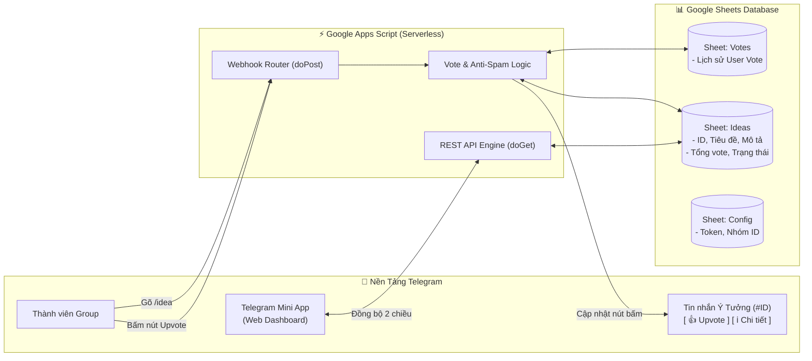

# 💡 ToolHunt - Telegram Community Idea & Vote Bot

<p align="center">
  
</p>

<p align="center">
  <b>Hệ thống đề xuất & bình chọn ý tưởng công cụ dành cho cộng đồng Telegram, tích hợp Google Sheets 2 chiều & Telegram Mini App Dashboard.</b>
</p>

<p align="center">
  <a href="https://github.com/tinycorn-studio/Tool-Hunt/blob/main/LICENSE"></a>
  <a href="https://core.telegram.org/bots/api"></a>
  <a href="https://developers.google.com/apps-script"></a>
  <a href="https://www.google.com/sheets/about/"></a>
  <a href="#"></a>
</p>

---

## 🌟 Điểm Nổi Bật (Key Features)

- ⚡ **100% Miễn Phí & Serverless:** Vận hành hoàn toàn trên hạ tầng của **Google Apps Script & Google Sheets**, không tốn chi phí thuê máy chủ/VPS.
- 🗳 **Bình Chọn Tương Tác Real-time (Inline Buttons):** Gắn nút `[ 👍 Upvote (0) ]` và `[ ℹ️ Chi tiết ]` trực tiếp dưới tin nhắn trong nhóm Telegram. Số lượt vote nhảy ngay lập tức khi thành viên tương tác.
- 🛡 **Cơ Chế Chống Gian Lận & Rút Vote (Anti-Spam & Toggle Unvote):** Mỗi User ID chỉ được vote 1 lần cho 1 ý tưởng. Nhấn lần thứ hai sẽ tự động hủy vote và trừ điểm tương ứng.
- 📊 **Quản Lý Bảng Tính Tự Động:** Tích hợp sẵn Menu **`🤖 Quản Lý Bot Telegram`** trong Google Sheets để tự động khởi tạo 4 sheet chuẩn hóa (`Ideas`, `Votes`, `Config`, `Admins`) và cài đặt Webhook chỉ với 1 cú click.
- 🌐 **Telegram Mini App & Web Dashboard:** Giao diện mobile-first theo phong cách *Product Hunt*, lọc theo trạng thái (`Đang lấy ý kiến`, `Đang phát triển`, `Đã hoàn thành`), hỗ trợ tìm kiếm và gửi đề xuất trực quan.
- 👑 **Phân Quyền Quản Trị Linh Hoạt (Admin Control):** Cho phép Admin cập nhật tiến độ ý tưởng trực tiếp qua lệnh `/status <ID> <Trạng thái>` hoặc chỉnh sửa ngay trên file Google Sheet.

---

## 🏗 Kiến Trúc Hệ Thống (Architecture)



---

## 📁 Cấu Trúc Dự Án (Project Structure)

```text
Tool-Hunt/
├── google-apps-script/
│   ├── Code.js              # Mã nguồn xử lý Webhook, lệnh Bot và REST API
│   ├── SetupHelper.js       # Tích hợp Menu cài đặt tự động vào Google Sheets
│   └── appsscript.json      # File cấu hình manifest của Apps Script
├── web-dashboard/
│   ├── index.html           # Giao diện Web Dashboard & Telegram Mini App
│   ├── styles.css           # Hiệu ứng Glassmorphism, animations và theme
│   └── app.js               # Logic tương tác, lọc, tìm kiếm, kết nối API
├── scripts/
│   ├── setup_webhook.js     # Tool CLI Node.js cài đặt và kiểm tra Webhook
│   ├── setup_webhook.py     # Tool CLI Python cài đặt Webhook
│   └── test_simulator.js    # Bộ kiểm thử tự động (13 unit tests)
├── docs/
│   ├── HUONG_DAN_CAI_DAT.md # Hướng dẫn cài đặt chi tiết từng bước từ A - Z
│   ├── HUONG_DAN_ADMIN.md   # Hướng dẫn quản trị và phân quyền Admin
│   └── TELEGRAM_BOTFATHER.md# Hướng dẫn tạo bot và cài đặt lệnh menu @BotFather
├── .gitignore               # Cấu hình bỏ qua tệp tạm
├── package.json             # Cấu hình NPM Scripts
└── README.md                # Tài liệu tổng quan dự án
```

---

## 🚀 Hướng Dẫn Cài Đặt Nhanh (3 Phút)

### 1. Tạo Google Sheet & Thêm Code
1. Tạo 1 file [Google Sheets mới](https://sheets.new).
2. Vào menu **Tiện ích mở rộng** (Extensions) ➔ **Apps Script**.
3. Dán mã nguồn từ [`google-apps-script/Code.js`](./google-apps-script/Code.js) và [`google-apps-script/SetupHelper.js`](./google-apps-script/SetupHelper.js) vào dự án Apps Script.
4. F5 lại Google Sheet ➔ Bấm menu **`🤖 Quản Lý Bot Telegram`** ➔ Chọn **`⚡ 1. Khởi tạo cấu trúc các Sheet`**.
5. Vào sheet `Config`, điền `BOT_TOKEN` của bạn (lấy từ `@BotFather`).

### 2. Triển khai Web App (Deploy)
1. Tại Apps Script: Bấm **Triển khai (Deploy)** ➔ **Triển khai mới (New deployment)**.
2. Chọn loại **Ứng dụng web (Web app)**:
   * **Thực thi dưới dạng:** *Tôi (Email của bạn)*
   * **Ai có quyền truy cập:** ***Bất kỳ ai (Anyone)***
3. Bấm **Triển khai** và copy **URL ứng dụng web**.

### 3. Đăng ký Webhook
1. Tại Google Sheet: Bấm menu **`🤖 Quản Lý Bot Telegram`** ➔ Chọn **`🔗 2. Đăng ký Webhook tự động`**.
2. Dán link Web App URL vừa copy vào và nhấn **OK**.
3. Thêm Bot vào nhóm Telegram, cấp quyền Admin và bắt đầu sử dụng!

👉 *Xem hướng dẫn chi tiết từng bước có hình ảnh minh họa tại: [`docs/HUONG_DAN_CAI_DAT.md`](./docs/HUONG_DAN_CAI_DAT.md)*

---

## 📌 Bảng Tra Cứu Lệnh Trong Nhóm (Bot Commands)

| Lệnh | Cú pháp | Quyền hạn | Ví dụ |
| :--- | :--- | :--- | :--- |
| **Đăng ý tưởng** | `/idea [Tên Tool] \| [Mô tả]` | Tất cả thành viên | `/idea Auto Sheet \| Tool tự cào giá Shopee lưu vào Sheet` |
| **Top Ý Tưởng** | `/top` | Tất cả thành viên | `/top` |
| **Ý Tưởng Của Tôi** | `/myideas` | Tất cả thành viên | `/myideas` |
| **Thống Kê** | `/stats` | Tất cả thành viên | `/stats` |
| **Cập Nhật Tiến Độ** | `/status [ID] [Trạng thái]` | **Chỉ Admin** | `/status 1 Đang phát triển` |
| **Trợ Giúp** | `/help` hoặc `/start` | Tất cả thành viên | `/help` |

---

## 🧪 Kiểm Thử Tự Động (Automated Testing)

Dự án tích hợp sẵn Mock Simulator để kiểm tra logic mà không cần kết nối mạng hay Telegram thật:

```bash
# Chạy bộ Unit Tests
npm test

# Hoặc chạy trực tiếp bằng Node.js
node scripts/test_simulator.js
```

Kết quả kiểm thử mẫu:
```text
======================================================
🧪 CHẠY KIỂM THỬ TỰ ĐỘNG (UNIT TESTS & LOGIC SIMULATOR)
======================================================
🔹 1. Kiểm tra xác thực cú pháp /idea:
  ✅ [PASS] Báo lỗi khi thiếu dấu gạch đứng (|)
🔹 2. Kiểm tra tạo ý tưởng mới:
  ✅ [PASS] Tạo thành công Idea #1 & #2
🔹 3. Kiểm tra tính năng Upvote:
  ✅ [PASS] Ghi nhận lượt vote chính xác (+1)
🔹 4. Kiểm tra chống gian lận & Rút lại vote:
  ✅ [PASS] Toggle Unvote thành công (-1)
🔹 5. Kiểm tra bảng xếp hạng /top & /stats:
  ✅ [PASS] Sắp xếp danh sách chính xác
🔹 6. Kiểm tra phân quyền Admin /status:
  ✅ [PASS] Chặn người dùng thường, Admin đổi trạng thái thành công
------------------------------------------------------
📊 KẾT QUẢ: 13 PASSED / 0 FAILED (100% SUCCESS)
------------------------------------------------------
```

---

## 🤝 Đóng Góp (Contributing)

Mọi đóng góp nhằm nâng cao tính năng cho **ToolHunt** đều được chào đón nồng nhiệt!
1. Fork dự án (`git clone https://github.com/tinycorn-studio/Tool-Hunt.git`)
2. Tạo nhánh tính năng mới (`git checkout -b feature/tinh-nang-moi`)
3. Commit thay đổi (`git commit -m 'Add: Tính năng mới'`)
4. Push lên nhánh (`git push origin feature/tinh-nang-moi`)
5. Mở **Pull Request** trên GitHub.

---

## 📄 Bản Quyền (License)

Dự án được phát triển bởi [Tinycorn Studio](https://github.com/tinycorn-studio) và phát hành theo giấy phép [MIT License](LICENSE). Tự do sử dụng, chỉnh sửa và triển khai cho mọi cộng đồng.
