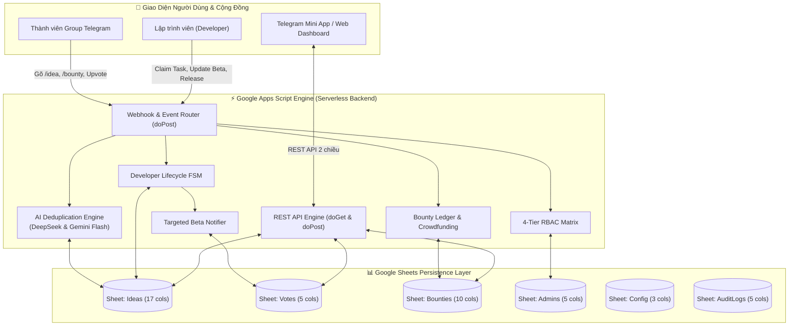

# 💡 ToolHunt Enterprise (v3.0.0) — Telegram Idea Hub & Developer Crowdfunding

<p align="center">
  
</p>

<p align="center">
  <b>Hệ thống quản lý, bình chọn ý tưởng công nghệ và gọi vốn cộng đồng (Tool Bounty) chuyên nghiệp dành cho Telegram Community, tích hợp AI Duplicate Detection (DeepSeek & Gemini), Developer Task Claiming, Targeted Beta Notifications và Google Sheets 2 chiều.</b>
</p>

<p align="center">
  <a href="https://github.com/tinycorn-studio/Tool-Hunt/blob/main/LICENSE"></a>
  <a href="https://core.telegram.org/bots/api"></a>
  <a href="https://developers.google.com/apps-script"></a>
  <a href="https://www.google.com/sheets/about/"></a>
  <a href="https://deepseek.com"></a>
  <a href="https://ai.google.dev"></a>
  <a href="#"></a>
</p>

---

## 🌟 Tính Năng Nổi Bật (Enterprise Features)

- 🤖 **R1. AI Duplicate Detection (DeepSeek & Gemini):** Nhận diện ngữ nghĩa ý tưởng trùng lặp thời gian thực với độ chính xác cao; tự động đề xuất dồn vote (`merge_vote`) hoặc xác nhận tạo mới (`force_create`).
- 🛠 **R2. Developer Task Claiming & Lifecycle FSM:** Lập trình viên nhận phát triển ý tưởng `[ 🛠 Nhận làm tool ]`, quản lý tiến độ mốc (`Milestones`) và chuyển giao trạng thái trực quan (`Đang phát triển` ➔ `Beta Testing` ➔ `Hoàn thành`).
- 🧪 **R3. Targeted Beta Tester Notifications:** Tự động lọc danh sách người dùng đã từng Upvote để gửi thông báo riêng (Direct Message / Mention) kèm link trải nghiệm bản Beta và form đánh giá.
- 💰 **R4. Tool Bounty & Crowdfunding:** Cơ chế tài trợ / treo thưởng đa đơn vị tiền tệ (VNĐ, USD, Coffee ☕, Points) với huy hiệu vàng nổi bật và sổ cái tài chính trên sheet `Bounties`.
- 👑 **R5. Phân Quyền 4 Cấp (4-Tier RBAC):** Kiểm soát phân quyền chặt chẽ (`Member`, `Developer`, `Manager`, `Admin`) trên toàn bộ Bot commands, Web Dashboard và REST API.
- ⚡ **100% Serverless & Miễn Phí Trọn Đời:** Hoạt động hoàn toàn trên hạ tầng Google Apps Script & Google Sheets, không tốn chi phí thuê server/VPS.

---

## 🏗 Kiến Trúc Hệ Thống (Architecture)



---

## 📁 Cấu Trúc Dự Án (Project Structure)

```text
Tool-Hunt/
├── google-apps-script/
│   ├── Code.js              # Mã nguồn xử lý Webhook, lệnh Bot, AI, Bounty, RBAC & REST API
│   ├── SetupHelper.js       # Tích hợp Menu cài đặt tự động 6 sheet Enterprise vào Google Sheets
│   └── appsscript.json      # File cấu hình manifest của Apps Script
├── web-dashboard/
│   ├── index.html           # Giao diện Web Dashboard & Telegram Mini App Enterprise
│   ├── styles.css           # Hiệu ứng Glassmorphism, huy hiệu Bounty vàng, Beta glow
│   └── app.js               # Logic client: AI duplicate modal, task claim, bounty, RBAC
├── scripts/
│   ├── setup_webhook.js     # Tool CLI Node.js cài đặt và kiểm tra Webhook
│   ├── setup_webhook.py     # Tool CLI Python cài đặt Webhook
│   └── test_simulator.js    # Bộ kiểm thử tự động toàn diện (10 suites, 48 assertions)
├── docs/
│   ├── HUONG_DAN_CAI_DAT.md # Hướng dẫn cài đặt chi tiết từng bước từ A - Z
│   ├── HUONG_DAN_ADMIN.md   # Hướng dẫn quản trị 4-tier RBAC và vòng đời phát triển
│   └── TELEGRAM_BOTFATHER.md# Hướng dẫn tạo bot và cài đặt lệnh menu @BotFather
├── .gitignore               # Cấu hình bỏ qua tệp tạm
├── package.json             # Cấu hình NPM Scripts
└── README.md                # Tài liệu tổng quan dự án
```

---

## 📌 Bảng Tra Cứu Lệnh Bot Telegram (Bot Commands)

| Lệnh | Cú pháp | Vai trò tối thiểu | Mô tả chức năng |
| :--- | :--- | :--- | :--- |
| **Đăng ý tưởng** | `/idea [Tên Tool] \| [Mô tả chi tiết]` | `Member` | Gửi ý tưởng mới, kích hoạt kiểm tra AI trùng lặp |
| **Treo thưởng** | `/bounty [ID] [Số tiền] [Đơn vị] [Lời nhắn]` | `Member` | Tài trợ/đặt hàng tool (VNĐ, Coffee ☕, USD) |
| **Top Ý Tưởng** | `/top` | `Member` | Xem Top 5 ý tưởng có lượt vote cao nhất |
| **Ý Tưởng Của Tôi** | `/myideas` | `Member` | Xem danh sách các ý tưởng do mình đề xuất |
| **Thống Kê** | `/stats` | `Member` | Xem tổng số ý tưởng, vote và tổng quỹ thưởng |
| **Nhận làm tool** | `/claim [ID]` hoặc nút `[ 🛠 Nhận làm tool ]` | `Developer` | Lập trình viên nhận phụ trách phát triển ý tưởng |
| **Hủy nhận task** | `/unclaim [ID]` hoặc nút `[ ❌ Hủy nhận ]` | `Developer` (Owner) / `Manager` | Hủy nhận để nhả task cho dev khác |
| **Đổi trạng thái** | `/status [ID] [Trạng thái mới]` | `Manager` / `Admin` | Quản trị viên cập nhật tiến độ ý tưởng |
| **Trợ Giúp** | `/help` hoặc `/start` | `Member` | Xem danh sách hướng dẫn các lệnh hệ thống |

---

## ⚙️ Bảng Cấu Hình Hệ Thống (`Config` Sheet)

| Khóa Cấu Hình (`Key`) | Giá Trị Mặc Định | Bắt Buộc | Mô Tả Chi Tiết |
| :--- | :--- | :--- | :--- |
| `BOT_TOKEN` | `""` | **Bắt buộc** | Mã token HTTP API cấp từ `@BotFather` |
| `WEBAPP_URL` | `""` | Tùy chọn | URL Web Dashboard / Telegram Mini App đã deploy |
| `COMMUNITY_GROUP_ID` | `""` | Tùy chọn | ID nhóm Telegram cộng đồng (dạng `-100xxxxxxxxx`) |
| `ADMIN_IDS` | `""` | Tùy chọn | Danh sách User ID Admin dự phòng (phân cách bằng dấu phẩy) |
| `AI_PROVIDER` | `deepseek` | Tùy chọn | Chọn nhà cung cấp AI chính: `deepseek` hoặc `gemini` |
| `AI_SIMILARITY_THRESHOLD` | `75` | Tùy chọn | Ngưỡng % tương đồng để kích hoạt cảnh báo trùng lặp (0 - 100) |
| `DEEPSEEK_API_KEY` | `""` | Khuyên dùng | API Key DeepSeek (`sk-...`) để quét ngữ nghĩa |
| `GEMINI_API_KEY` | `""` | Khuyên dùng | API Key Google Gemini (miễn phí) dùng làm dự phòng failover |
| `DEMO_BASE_URL` | `https://toolhunt.enterprise/demo/` | Tùy chọn | URL tiền tố cho bản demo trải nghiệm Beta |
| `FEEDBACK_BASE_URL` | `https://toolhunt.enterprise/feedback/` | Tùy chọn | URL tiền tố cho form góp ý Beta |

---

## 🚀 Hướng Dẫn Cài Đặt Nhanh (3 Phút)

### 1. Tạo Google Sheet & Thêm Code
1. Tạo 1 file [Google Sheets mới](https://sheets.new).
2. Vào menu **Tiện ích mở rộng (Extensions)** ➔ **Apps Script**.
3. Dán mã nguồn từ [`google-apps-script/Code.js`](./google-apps-script/Code.js) và [`google-apps-script/SetupHelper.js`](./google-apps-script/SetupHelper.js) vào dự án Apps Script.
4. F5 lại Google Sheet ➔ Bấm menu **`🤖 Quản Lý ToolHunt Enterprise`** ➔ Chọn **`⚡ 1. Khởi tạo cấu trúc 6 Sheet Enterprise`**.
5. Vào sheet `Config`, điền `BOT_TOKEN` (lấy từ `@BotFather`), `DEEPSEEK_API_KEY` và `GEMINI_API_KEY`.

### 2. Triển khai Web App (Deploy)
1. Tại Apps Script: Bấm **Triển khai (Deploy)** ➔ **Triển khai mới (New deployment)**.
2. Chọn loại **Ứng dụng web (Web app)**:
   * **Thực thi dưới dạng:** *Tôi (Email của bạn)*
   * **Ai có quyền truy cập:** ***Bất kỳ ai (Anyone)***
3. Bấm **Triển khai** và copy **URL ứng dụng web**.

### 3. Đăng ký Webhook
1. Tại Google Sheet: Bấm menu **`🤖 Quản Lý ToolHunt Enterprise`** ➔ Chọn **`🔗 2. Đăng ký Telegram Webhook tự động`**.
2. Dán link Web App URL vừa copy ở Bước 2 vào và nhấn **OK**.
3. Thêm Bot vào nhóm Telegram, cấp quyền Admin và bắt đầu sử dụng!

👉 *Xem hướng dẫn chi tiết từng bước tại: [`docs/HUONG_DAN_CAI_DAT.md`](./docs/HUONG_DAN_CAI_DAT.md)*

---

## 🧪 Kiểm Thử Tự Động Toàn Diện (Automated Testing)

Chạy bộ kiểm thử tự động 10 Suites (48 assertions) kiểm tra 100% các kịch bản offline:

```powershell
# Chạy bộ test suite
npm test

# Hoặc chạy trực tiếp qua Node.js
node scripts/test_simulator.js
```

Kết quả kiểm thử thực tế:
```text
================================================================================
📊 KẾT QUẢ TỔNG QUAN KIỂM THỬ (SUMMARY REPORT)
================================================================================
⏱️ Thời gian thực thi: ~30ms
📋 Tổng số bài kiểm thử: 48 assertions across 10 test suites

  ✅ Suite 1: Syntax & Command Validation                 -> 4 passed / 0 failed
  ✅ Suite 2: Idea Creation & Telegram Card Formatting    -> 4 passed / 0 failed
  ✅ Suite 3: R1 AI Duplicate Detection                   -> 6 passed / 0 failed
  ✅ Suite 4: Upvote & Anti-Fraud (Toggle Unvote)         -> 5 passed / 0 failed
  ✅ Suite 5: R2 Developer Task Claiming Lifecycle        -> 6 passed / 0 failed
  ✅ Suite 6: R3 Targeted Beta Notifications              -> 4 passed / 0 failed
  ✅ Suite 7: R4 Tool Bounty & Crowdfunding               -> 5 passed / 0 failed
  ✅ Suite 8: R5 4-Tier RBAC Permission Matrix            -> 4 passed / 0 failed
  ✅ Suite 9: R5 REST API Contracts                       -> 6 passed / 0 failed
  ✅ Suite 10: R5 Dual-Platform Sync & Concurrency        -> 4 passed / 0 failed
--------------------------------------------------------------------------------
🎯 TỔNG KẾT: 48 PASSED / 0 FAILED (100% SUCCESS)
🎉 TẤT CẢ 10 BỘ KIỂM THỬ ĐÃ VƯỢT QUA 100%! HỆ THỐNG SẴN SÀNG TRIỂN KHAI.
================================================================================
```

---

## 🤝 Đóng Góp (Contributing)

Mọi đóng góp nhằm nâng cao tính năng cho **ToolHunt Enterprise** đều được chào đón nồng nhiệt!
1. Fork dự án (`git clone https://github.com/tinycorn-studio/Tool-Hunt.git`)
2. Tạo nhánh tính năng mới (`git checkout -b feature/tinh-nang-moi`)
3. Commit thay đổi (`git commit -m 'Add: Tính năng mới'`)
4. Push lên nhánh (`git push origin feature/tinh-nang-moi`)
5. Mở **Pull Request** trên GitHub.

---

## 📄 Bản Quyền (License)

Dự án được phát triển bởi [Tinycorn Studio](https://github.com/tinycorn-studio) và phát hành theo giấy phép [MIT License](LICENSE). Tự do sử dụng, chỉnh sửa và triển khai cho mọi cộng đồng.
